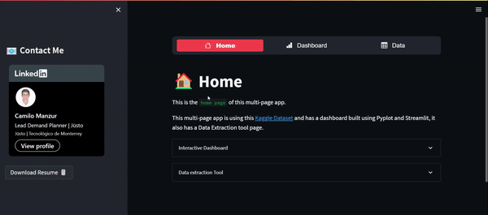
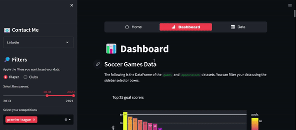
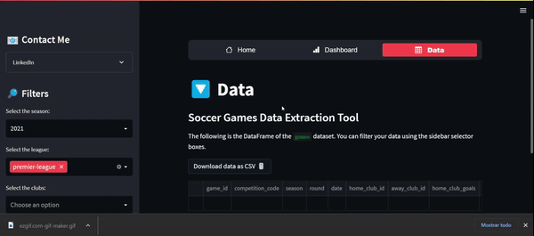

# 📊 Soccer Stats Dashboard


<div id="top"></div>
<!--
*** Thanks for checking out the Best-README-Template. If you have a suggestion
*** that would make this better, please fork the repo and create a pull request
*** or simply open an issue with the tag "enhancement".
*** Don't forget to give the project a star!
*** Thanks again! Now go create something AMAZING! :D
-->


<!-- PROJECT SHIELDS -->
<!--
*** I'm using markdown "reference style" links for readability.
*** Reference links are enclosed in brackets [ ] instead of parentheses ( ).
*** See the bottom of this document for the declaration of the reference variables
*** for contributors-url, forks-url, etc. This is an optional, concise syntax you may use.
*** https://www.markdownguide.org/basic-syntax/#reference-style-links
-->
[![Contributors][contributors-shield]][contributors-url]
[![Forks][forks-shield]][forks-url]
[![Stargazers][stars-shield]][stars-url]
[![Issues][issues-shield]][issues-url]
[![LinkedIn][linkedin-shield]][linkedin-url]


<!-- PROJECT LOGO -->
<br />
<div align="center">

  </a>

<h3 align="center">Soccer Stats Dashboard App</h3>

  <p align="center">
    This project was made using Python, specifically Pandas, Plotly and specially Streamlit, this web app lets you explore and interact through a dashboard with soccer data from the 2011-2021 seasons with statistics in different levels (Club and Player).
    <br />
    <a href="https://github.com/camiloms10/soccer_stats_dashboard"><strong>Explore the docs »</strong></a>
    <br />
    <br />
    <a href="https://github.com/camiloms10/soccer_stats_dashboard/issues">Report Bug</a>
    ·
    <a href="https://github.com/camiloms10/soccer_stats_dashboard/issues">Request Feature</a>
  </p>
</div>


<!-- TABLE OF CONTENTS -->
<details>
  <summary>Table of Contents</summary>
  <ol>
    <li>
      <a href="#about-the-project">About The Project</a>
      <ul>
        <li><a href="#built-with">Built With</a></li>
      </ul>
    </li>
    <li>
      <a href="#getting-started">Getting Started</a>
      <ul>
        <li><a href="#prerequisites">Prerequisites</a></li>
        <li><a href="#data-sources">Data Sources</a></li>
      </ul>
    </li>
    <li><a href="#usage">Usage</a></li>
    <li><a href="#roadmap">Roadmap</a></li>
    <!--<li><a href="#contributing">Contributing</a></li>-->
    <!--<li><a href="#license">License</a></li>-->
    <li><a href="#contact">Contact</a></li>
    <!--<li><a href="#acknowledgments">Acknowledgments</a></li>-->
  </ol>
</details>


<!-- ABOUT THE PROJECT -->
## 1️⃣ About The Project

Throughout this project you´ll find a developed webapp, with which you can interact to analyze and extract data insights about soccer, specifically club an player metrics such as goals, assists and points from match results.
<p align="right">(<a href="#top">back to top</a>)</p>


### Built With

* [Python](https://www.python.org)
* [Streamlit](https://streamlit.io/)

<p align="right">(<a href="#top">back to top</a>)</p>


<!-- GETTING STARTED -->
## 2️⃣ Getting Started

### Execute in the Web

To see and interact with the dashboard you can access through this [link](https://camiloms10-soccer-stats-dashboard-app-uisfh2.streamlitapp.com/).

### Prerequisites

These are the python libraries you´ll need to run the install if you want to replicate this dashboard locally, I also suggest you read [Streamlit documentation](https://streamlit.io/) and install it properly.
* Libraries
  ```sh
  pip install streamlit
  pip install numpy
  pip install matplotlib
  pip install pandas
  pip install sklearn 
  pip install scipy
  pip install plotly
  pip install python-math
  pip install streamlit-option-menu
   ```

<p align="right">(<a href="#top">back to top</a>)</p>

### Data Sources

The data source of this project where downloaded from [Kaggle](https://www.kaggle.com/datasets/davidcariboo/player-scores)

<p align="right">(<a href="#top">back to top</a>)</p>


<!-- USAGE EXAMPLES -->
## 3️⃣ Usage

You can use this dashboard to analyze:
* How a player has performed through time
* The correlation between individual statistics and player value
* Club performance (Goals For, Goals Against, Points) in 3 different views:
    * Home, Away and General
<p align="right">(<a href="#top">back to top</a>)</p>


<!-- ROADMAP -->
## 4️⃣ Roadmap

To do ALL of the following web app developement I used *Streamlit*, you can find more about this tool [here](https://streamlit.io/). 

Now, to generate this multi-page app I followed this steps:

### 1. Creating the basic layout of the webpage

<p align ="center">
<a href="https://camiloms10-soccer-stats-dashboard-app-uisfh2.streamlitapp.com/">

</a>

* I´ve included a home page in which you can get basic knowledge about what the web app has and how it is structured, this page also has a direct link to my [LinkedIn](https://www.linkedin.com/in/camilo-manzur-4b7137a8/?trk=public-profile-badge-profile-badge-view-profile-cta&originalSubdomain=mx) and you can also download my resume.
</p>

### 2. Exploring the data

<p align ="center">

* The main tables (csv files) used to generate the dashboard page are:
  * games.csv: 55,000+ games from many seasons on all major competitions
  * appearances.csv: 1,000,000+ player appearance records from all games


#### **Games table**
|game_id|competition_code|season|round                       |date      |home_club_id|away_club_id|home_club_goals|away_club_goals|
|-------|----------------|------|----------------------------|----------|------------|------------|---------------|---------------|
|2244388|SUC             |2012  |final 1st leg               |2012-08-22|131         |418         |3              |2              |
|2219794|BESC            |2011  |Final                       |2012-07-22|58          |498         |3              |2              |
|2244389|SUC             |2012  |final 2nd leg               |2012-08-29|418         |131         |2              |1              |
|2271112|DFB             |2012  |Round of 16                 |2012-12-18|48          |60          |0              |1              |
|2229332|DFL             |2012  |Final                       |2012-08-12|27          |16          |2              |1              |
|2258406|POCP            |2012  |Group D                     |2012-08-05|2423        |3336        |3              |1              |
|2240525|NLP             |2012  |First Round                 |2012-08-22|19934       |16866       |4              |1              |
|2240524|NLP             |2012  |First Round                 |2012-08-22|2821        |2848        |4              |2              |
|2504433|NLP             |2012  |First Round                 |2012-08-22|7474        |34455       |4              |1              |

* Then we got secondary tables mainly to bring the names of competitions, clubs, player characteristics, etc.
</p>

#### **Leagues table**

<center>

| **league_id** | **name**             | **confederation** |
|:-------------:|:--------------------:|:-----------------:|
| L1            | bundesliga           | europa            |
| NL1           | eredivisie           | europa            |
| BE1           | jupiler-pro-league   | europa            |
| ES1           | laliga               | europa            |
| PO1           | liga-nos             | europa            |
| FR1           | ligue-1              | europa            |
| GB1           | premier-league       | europa            |
| RU1           | premier-liga         | europa            |
| UKR1          | premier-liga         | europa            |
| SC1           | scottish-premiership | europa            |
| IT1           | serie-a              | europa            |
| GR1           | super-league-1       | europa            |
| TR1           | super-lig            | europa            |
| DK1           | superligaen          | europa            |

</center>

Finally I created some complementary columns in each primary dataframe (games/appearances) such as:
  * Result/Winner = defined by  the home and away goals, the results for this column could be H(Home), A(Away) and D(Draw).
  * Home points = defined by the Result/Winner column, te results for this column could be 3,1 or 0. 
  * Away points = defined by the Result/Winner column, te results for this column could be 3,1 or 0.
  * G+A = defined by the sum of the goals and assists columns of the appearances dataframe.
  * G+A per 90 min = defined by the G+A column divided by the minutes played column, then multiplied by 90 in order to get the ratio.
</p>


### 3. Creating the dashboard tab

<p align ="center">

</p>

First I defined the 2 main dataframes to interact with in a specific filter:
  1. Games dataframe: This dataframe will show the metrics in a Club level (Goals, Points).
  2. Appearances dataframe: This dataframe will show the metrics in a Player level (Goals, Assist, Value).

So for instance, if you select to view metrics in a Club level the filters will be a bit different from the Player level view, the Clubs be can be filter by Club and the Player view can be filtered by position. Both of the dataframes can be filtered by season and by league.

The filter work in different ways, I'll explain a bit more now:

  1. Season: Multiselection slider for any years the user wants to view (from 2013 to 2021).
  2. Competitions: Multiselection box to analyze multiple leagues at once (premier, laliga, etc.).
  3. Player positions: Multiselection box to analyze multiple positions at once (Attack, Midfield, etc.).
  4. Clubs: Multiselection box to analyze multiple clubs performance at once (from the competitions the user selected).

### 4. Creating the data extraction tab

<p align ="center">

</p>

The data extraction tool lets you obtain an extraction of the **games.csv** file as a new csv file for you to interact as you wish.

For this simple extraction tool I defined the main filters I wanted to include for anyone to filter this dataframe, the filters are the following:
* Season
* League
* Club

This extraction will let you know how any team performed in every game of a given season in their national league, the leagues and clubs filter let you select multiple choices at once.

## 5️⃣ Final Conclusions

- While developing this project I learned to use the Streamlit Python library to develop an interactive dashboard using other libraries (pandas, pyplot), this is a powerful tool as this can give any team the ability to interact with significant data with the filters they need (specific league, season, club, etc.) to obtain insights like trends, opportunities and defects.


See the [open issues](https://github.com/camiloms10/soccer_stats_dashboard/issues) for a full list of proposed features (and known issues).

<p align="right">(<a href="#top">back to top</a>)</p>


<!-- CONTRIBUTING 
## Contributing

Contributions are what make the open source community such an amazing place to learn, inspire, and create. Any contributions you make are **greatly appreciated**.

If you have a suggestion that would make this better, please fork the repo and create a pull request. You can also simply open an issue with the tag "enhancement".
Don't forget to give the project a star! Thanks again!

1. Fork the Project
2. Create your Feature Branch (`git checkout -b feature/AmazingFeature`)
3. Commit your Changes (`git commit -m 'Add some AmazingFeature'`)
4. Push to the Branch (`git push origin feature/AmazingFeature`)
5. Open a Pull Request

<p align="right">(<a href="#top">back to top</a>)</p>
-->


<!-- LICENSE 
## License

Distributed under the MIT License. See `LICENSE.txt` for more information.

<p align="right">(<a href="#top">back to top</a>)</p>
-->


<!-- CONTACT -->
## 6️⃣ Contact

Camilo Manzur - [@LinkedIn](https://www.linkedin.com/in/camilo-manzur-4b7137a8/)

Project Link: [https://github.com/camiloms10/soccer_stats_dashboard/](https://github.com/camiloms10/soccer_stats_dashboard)

<p align="right">(<a href="#top">back to top</a>)</p>


<!-- ACKNOWLEDGMENTS 
## Acknowledgments

* []()
* []()
* []()

<p align="right">(<a href="#top">back to top</a>)</p>
-->


<!-- MARKDOWN LINKS & IMAGES -->
<!-- https://www.markdownguide.org/basic-syntax/#reference-style-links -->
[contributors-shield]: https://img.shields.io/github/contributors/camiloms10/soccer_stats_dashboard.svg?style=for-the-badge
[contributors-url]: https://github.com/camiloms10/soccer_stats_dashboard/graphs/contributors
[forks-shield]: https://img.shields.io/github/forks/camiloms10/soccer_stats_dashboard.svg?style=for-the-badge
[forks-url]: https://github.com/camiloms10/soccer_stats_dashboard/network/members
[stars-shield]: https://img.shields.io/github/stars/camiloms10/soccer_stats_dashboard.svg?style=for-the-badge
[stars-url]: https://github.com/camiloms10/soccer_stats_dashboard/stargazers
[issues-shield]: https://img.shields.io/github/issues/camiloms10/soccer_stats_dashboard.svg?style=for-the-badge
[issues-url]: https://github.com/camiloms10/soccer_stats_dashboard/issues
[linkedin-shield]: https://img.shields.io/badge/-LinkedIn-black.svg?style=for-the-badge&logo=linkedin&colorB=555
[linkedin-url]: https://www.linkedin.com/in/camilo-manzur-4b7137a8/
[product-screenshot]: images/screenshot.png